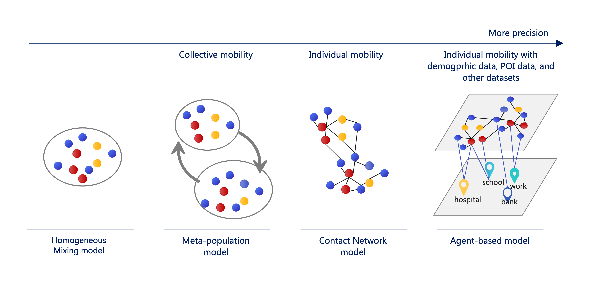
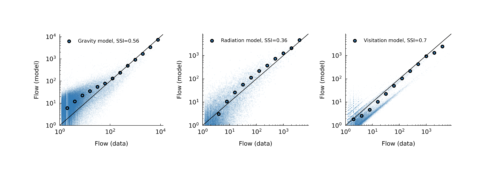
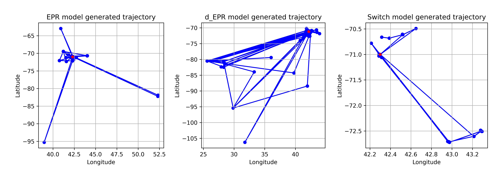
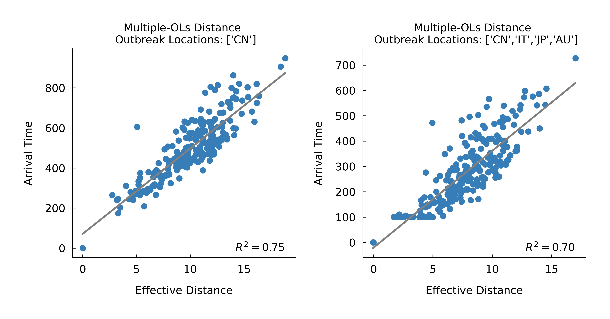
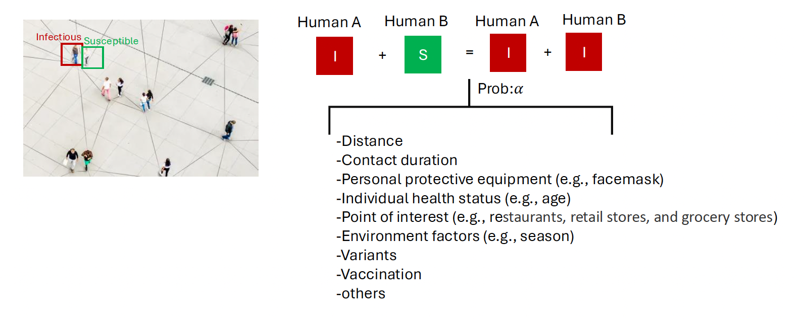
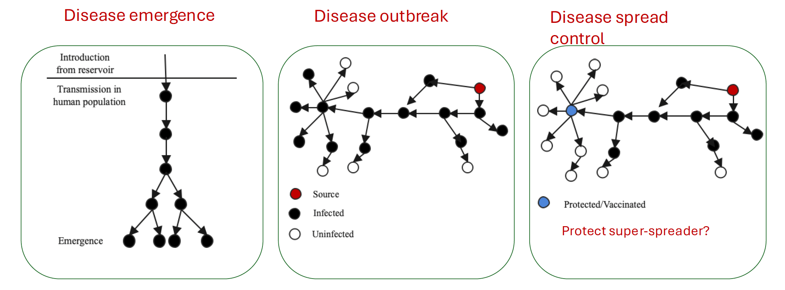

<body>

<h1 id="top">Human Mobility, Mobility Networks, and Epidemic Intelligence</h1>

  <b>TThis repository provides codes, analyses, and research notes on human mobility modeling and infectious disease spreading. Topics include collective and individual mobility models, epidemic dynamics on mobility networks, and network-based approaches for epidemic prediction and control.</b>

  

<h1>Table of Contents</h1>

<ul>
  <li><a href="#human-mobility">1. Human Mobility</a>
    <ul>
      <li><a href="#collective-mobility">1.1 Collective Mobility</a>
        <ul>
          <li><a href="#gravity-model">Gravity Model</a></li>
          <li><a href="#radiation-model">Radiation Model</a></li>
          <li><a href="#visitation-model">Visitation Model</a></li>
          <li><a href="#comparison-collective">Comparison of Collective Mobility Models</a></li>
        </ul>
      </li>
      <li><a href="#individual-mobility">1.2 Individual Mobility</a>
        <ul>
          <li><a href="#epr-model">EPR Model</a></li>
          <li><a href="#d-epr-model">d-EPR Model</a></li>
          <li><a href="#pepr-model">PEPR Model</a></li>
          <li><a href="#switch-model">Switch Model</a></li>
          <li><a href="#comparison-individual">Comparison of Individual Mobility Models</a></li>
        </ul>
      </li>
    </ul>
  </li>

  <li><a href="#mobility-networks">2. Mobility Networks</a>
    <ul>
      <li><a href="#network-topology">Network Topology</a></li>
      <li><a href="#effective-distance">Effective Distance</a></li>
      <li><a href="#effective-distance-multiple-outbreaks">Effective Distance with Multiple Outbreak Locations</a></li>
    </ul>
  </li>

  <li><a href="#epidemic-dynamics">3. Epidemic Dynamics</a>
    <ul>
      <li><a href="#sir-metapopulation">SIR Metapopulation Model</a></li>
      <li><a href="#poi-metapopulation">POI Metapopulation Model</a></li>
      <li><a href="#agent-based-models">Agent-based Models</a></li>
      <li><a href="#wastewater-surveillance-models">Wastewater Surveillance Models</a></li>
    </ul>
  </li>

  <li><a href="#epidemic-intelligence-control">4. Epidemic Intelligence and Control</a>
    <ul>
      <li><a href="#source-identification">Source Identification</a></li>
      <li><a href="#travel-restrictions">Travel Restrictions</a></li>
      <li><a href="#ehr-wastewater-forecasting">EHR and Wastewater-Informed Forecasting</a></li>
      <li><a href="#multi-pathogen-intelligence">Multi-pathogen Epidemic Intelligence</a></li>
    </ul>
  </li>

  <li><a href="#references">References</a></li>
</ul>

<h1 id="human-mobility">1. Human Mobility</h1>

  Human mobility can be studied from two complementary perspectives. Collective mobility models describe aggregated population flows between locations, while individual mobility models describe the trajectories and behavioral mechanisms of individual travelers. Together, these models provide the foundation for constructing mobility networks and understanding epidemic spreading processes.

<h2 id="collective-mobility">1.1 Collective Mobility</h2>

<h3 id="gravity-model">Gravity Model</h3>

  Inspired by Newton's law of gravitation, George K. Zipf proposed an equation to model mobility flows. The model assumes that the number of trips originating from location <i>i</i> is proportional to its population, and the attractiveness of destination <i>j</i> is proportional to its population at the cost of distance.

  <i>Tij = K MiNj f(rij)</i>

  where <i>K</i> is a constant, <i>Mi</i> and <i>Nj</i> represent the masses of the origin and destination, and <i>f(rij)</i> is a decreasing function of distance. A commonly used form is
  <i>Mi=Pi&alpha;</i> and
  <i>Nj=Pj&beta;</i>.

<h3 id="radiation-model">Radiation Model</h3>

  The Radiation Model (Simini et al., 2012) presents a parameter-free approach to estimating commuting flows between two locations. Unlike traditional gravity-based models, which rely on tunable parameters to fit empirical data, the Radiation Model derives mobility flows from population distribution alone.

  The model assumes that the number of trips from origin location <i>i</i> to destination <i>j</i> depends not only on the populations of the two locations but also on the presence of alternative opportunities in surrounding areas. By introducing <i>Sij</i>, the population within radius <i>rij</i> centered around location <i>i</i>, the model predicts the flow as:

  <i>
    E(Tij) =
    TiMiNj
    /
    (Mi + Sij)(Mi + Nj + Sij)
  </i>

<h3 id="visitation-model">Visitation Model</h3>

  Schläpfer et al. (2021), through extensive data analysis, identified a key relationship governing the frequency and spatial distribution of human visits. Their research reveals that the number of visitors <i>Ni(r,f)</i> at a location systematically decreases with travel distance <i>r</i> and travel frequency <i>f</i>. The visitation density is defined as:

  <i>
    &rho;i(r,f)
    =
    Ni(r,f)/A(r)
    =
    &mu;i/(rf)&eta;
  </i>

  The average number of trips made by individuals living in location <i>i</i> to destination <i>j</i> can be estimated as:

  <i>
    Tij
    &approx;
    &mu;jAi
    /
    rij2
    ln(fmax/fmin)
  </i>

  where <i>Ai</i> is the area of the origin location, <i>rij</i> is the distance between two locations, and <i>&mu;j</i> is the destination-specific attractiveness.

<h3 id="comparison-collective">Comparison of Collective Mobility Models</h3>

  We use the Sørensen Similarity Index (SSI) to measure the similarity between estimated flows and true flows between two locations. The SSI is between 0 and 1, where a higher value indicates higher similarity and accuracy.

  <i>
    SSI =
    2 &sum;ij
    min(Tijmodel, Tijdata)
    /
    (&sum;Tijmodel + &sum;Tijdata)
  </i>

<table>
  <tr>
    <th>Model</th>
    <th>Key Assumption</th>
    <th>SSI</th>
  </tr>
  <tr>
    <td>Gravity Model</td>
    <td>Population attraction and distance decay</td>
    <td>0.56</td>
  </tr>
  <tr>
    <td>Radiation Model</td>
    <td>Population distribution and intervening opportunities</td>
    <td>0.46</td>
  </tr>
  <tr>
    <td>Visitation Model</td>
    <td>Universal visitation scaling law</td>
    <td>0.70</td>
  </tr>
</table>

  

<h2 id="individual-mobility">1.2 Individual Mobility</h2>

  While collective mobility models estimate aggregated flows between regions, individual mobility models describe the behavioral mechanisms that generate human trajectories. These models capture exploration, preferential return, long-distance travel, and modular movement patterns.

<h3 id="epr-model">EPR Model</h3>

  The EPR (Exploration and Preferential Return) model (Song et al., 2010) is a classical individual mobility model that describes human mobility dynamics based on two fundamental behavioral tendencies. This model captures individual mobility scaling, including:

<ul>
  <li>the growth of unique locations, <i>S(t) ~ t&mu;</i>;</li>
  <li>Zipf's law of visitation frequency;</li>
  <li>ultraslow diffusion.</li>
</ul>

  <b>Exploration:</b> With probability <i>P=&rho;S-&gamma;</i>, the individual explores a new location.

  <b>Preferential Return:</b> With probability <i>1-P</i>, the individual returns to a previously visited location according to its past visitation frequency <i>fi</i>.

<h3 id="d-epr-model">d-EPR Model</h3>

  Unlike the EPR model, where individuals randomly select a new location during exploration, the d-EPR model (Pappalardo et al., 2015) proposes that individuals visit new locations according to gravity-model probability <i>Pij</i>. This mechanism generates longer-distance paths and stronger connectivity across regions.

<h3 id="pepr-model">PEPR Model</h3>

  The Preferential Exploration and Preferential Return (PEPR) model (Schläpfer et al., 2021) states that when individuals explore new locations, they tend to favor areas that are frequently visited. Specifically, exploration direction is biased toward regions with high visitation intensity, characterized by distribution <i>P(&theta;; R,v)</i>.

<h3 id="switch-model">Switch Model</h3>

  Human mobility exhibits distinct spatial and topological characteristics: it is modular, and within each module, hub locations facilitate revisitation. This configuration demonstrates high modularity but low clustering coefficients.

  To reproduce these patterns, Zhong et al. (2025; 2026) proposed the Switch Model, which introduces switching mechanisms governing transitions both within and across modules. The model captures modular-like human trajectories and switching exploration modes across spatial scales.

<h3 id="comparison-individual">Comparison of Individual Mobility Models</h3>

<ul>
  <li><b>EPR Model:</b> local exploration and preferential return.</li>
  <li><b>d-EPR Model:</b> gravity-driven long-distance exploration.</li>
  <li><b>PEPR Model:</b> visitation-biased exploration.</li>
  <li><b>Switch Model:</b> modular trajectories and switching exploration modes.</li>
</ul>

  

<h1 id="mobility-networks">2. Mobility Networks</h1>

  Human mobility models generate mobility networks connecting cities, counties, regions, and countries. In such networks, nodes represent geographic units and weighted directed edges represent mobility flows. These networks provide the spatial substrate through which infectious diseases spread.

<h2 id="network-topology">Network Topology</h2>

  Mobility networks are not random. They often exhibit heterogeneous degree distributions, spatial embedding, hub-and-spoke structures, community organization, and modularity. These topological properties strongly influence epidemic spreading patterns, outbreak arrival times, and intervention effectiveness.

<h2 id="effective-distance">Effective Distance</h2>

  Brockmann and Helbing (2013) introduced the concept of effective distance to reveal the hidden geometry of mobility-driven contagion phenomena. While geographic distance measures physical separation, effective distance measures epidemic proximity through mobility flows.

  <i>dmn = 1 - logPmn</i>

  where <i>Pmn</i> is the mobility probability from node <i>m</i> to node <i>n</i>. The effective distance between an outbreak source <i>k</i> and node <i>m</i> is the shortest-path distance in effective-distance space:

  <i>
    Dmk
    =
    &sum;(i,j)&in;&Gamma;
    dij
  </i>

  Effective distance can predict arrival times of epidemics more accurately than geographic distance:

  <i>Dmk &sim; Tmarrival</i>

<h2 id="effective-distance-multiple-outbreaks">Effective Distance with Multiple Outbreak Locations</h2>

  Real-world epidemics often involve multiple outbreak locations whose importance changes over time. Zhong et al. (2021) generalized effective-distance theory to account for multiple outbreak locations. Given an outbreak set <i>NI</i>, the distance from multiple sources to node <i>m</i> is defined as:

  <i>
    Dm|NI
    =
    log
    (
    1/
    &sum;ni&in;NI
    e-Dm|ni
    )
  </i>

  This framework enables the identification of shifting epidemic sources and improves arrival-time prediction when outbreaks emerge from multiple locations simultaneously.

  

<h1 id="epidemic-dynamics">3. Epidemic Dynamics</h1>

  Mobility networks provide the substrate upon which infectious diseases spread. Epidemic dynamics models describe how local transmission and mobility-driven importation jointly shape disease propagation.

<h2 id="sir-metapopulation">SIR Metapopulation Model</h2>

  The Susceptible-Infectious-Recovered (SIR) metapopulation model is a mathematical framework used to study disease spread across multiple interconnected populations. Unlike the classic SIR model, which assumes a single well-mixed population, the metapopulation approach accounts for spatial heterogeneity by dividing the population into distinct subpopulations connected by mobility or migration dynamics.

  Let there be <i>n</i> regions, each governed by standard SIR dynamics. Individuals exist in three states: susceptible <i>sn</i>, infected <i>in</i>, and removed <i>rn</i>. Disease transmission within each subpopulation follows local interactions, while inter-subpopulation spread is driven by the mobility flow matrix <i>Pmn</i>.

  <i>
    s&#775;n
    =
    -&alpha;snin&sigma;(in/&epsilon;)
    +
    &gamma;
    &sum;m&ne;n
    Pmn(sm-sn)
  </i>

  <i>
    i&#775;n
    =
    &alpha;snin&sigma;(in/&epsilon;)
    -
    &beta;in
    +
    &gamma;
    &sum;m&ne;n
    Pmn(im-in)
  </i>

  With a single initial outbreak location <i>k</i>, the initial conditions are:

  <i>
    sk=skreal,
    ik=ikreal,
    rk=rkreal
  </i>

<h2 id="poi-metapopulation">POI Metapopulation Model</h2>

  Chang et al. (2021) proposed a bipartite graph model that links Census Block Groups (CBGs), where people reside, to Points of Interest (POIs) that people visit. In this model, disease transmission occurs both within residential communities and through visits to shared locations.

  This framework captures how mobility to restaurants, workplaces, grocery stores, schools, and other POIs can shape infection risk. It also helps explain heterogeneous impacts of COVID-19 across socioeconomic groups and supports reopening-policy evaluation.

<h2 id="agent-based-models">Agent-based Models</h2>

  Agent-based epidemic models (ABMs) simulate the spread of infectious diseases by modeling the behaviors and interactions of individual agents. Unlike compartmental models that rely on population-level assumptions, ABMs capture heterogeneity in age, behavior, location, health status, and contact patterns (Zhang et al. 2018).

  

  In real-world populations, individuals do not mix randomly. People interact through structured social, spatial, and organizational patterns. Networks represent these interactions by modeling agents as nodes and relationships, physical contacts, shared spaces, or communication channels as edges. Embedding agents in networks allows ABMs to reproduce realistic contact pathways and intervention effects.

  

<h2 id="wastewater-surveillance-models">Wastewater Surveillance Models</h2>

  Wastewater-based epidemiology (WBE) has emerged as an effective population-level surveillance approach for monitoring infectious diseases. Because infected individuals shed viral particles regardless of whether they develop symptoms or seek clinical testing, wastewater measurements can provide an early signal of community-level infection dynamics.

  Wastewater surveillance can be integrated with mobility networks and renewal models to estimate hidden infections, improve forecasts, and detect outbreaks when clinical case data are delayed, sparse, or incomplete.

<h1 id="epidemic-intelligence-control">4. Epidemic Intelligence and Control</h1>

  Epidemic intelligence integrates surveillance, modeling, forecasting, and intervention. In mobility-network-based disease systems, epidemic intelligence aims to answer three questions:

<ul>
  <li><b>Where did the outbreak originate?</b></li>
  <li><b>Where will it spread next?</b></li>
  <li><b>How can interventions reduce transmission most efficiently?</b></li>
</ul>

<h2 id="source-identification">Source Identification</h2>

  Identifying outbreak sources is a fundamental problem in epidemic control. Given observed infection patterns across a network, the objective is to infer the most probable outbreak location.

  Using effective-distance theory, the outbreak source can be estimated by minimizing the variance between effective distances and observed arrival times (Wang et al.2022):

  <i>
    k*
    =
    argmink
    Var(Dmk-Tm)
  </i>

  This framework can identify both single and multiple outbreak locations and track shifting epidemic sources over time.

<h2 id="travel-restrictions">Travel Restrictions</h2>

  Travel restrictions reduce infection transmission by decreasing mobility flows between regions (Zhong et al. 2021). Let <i>Pmn</i> denote the mobility flow from region <i>m</i> to region <i>n</i>. An intervention modifies the flow matrix as:

  <i>
    P'mn
    =
    wmnPmn
  </i>

  where <i>0 &le; wmn &le; 1</i> is the intervention strength.

  Travel-restriction strategies include:

<ul>
  <li>uniform reduction of all flows;</li>
  <li>targeted removal of high-risk routes;</li>
  <li>dynamic travel controls based on epidemic risk.</li>
</ul>

<h2 id="ehr-wastewater-forecasting">EHR and Wastewater-Informed Forecasting</h2>

  EHRs provide near-real-time information on healthcare utilization, diagnoses, symptoms, hospitalizations, and clinical burden. Wastewater surveillance provides population-level signals of infection activity, including asymptomatic and unreported infections. Together, these complementary signals improve robustness when one data stream is delayed, missing, or biased.

  Zhong et al. (2026) proposed a spatial EHR and wastewater-informed modeling framework for respiratory virus prediction under sparse and missing data conditions. The framework integrates EHR signals, wastewater measurements, and spatial dependence to forecast respiratory viruses.

<h2 id="multi-pathogen-intelligence">Multi-pathogen Epidemic Intelligence</h2>

  The integration of mobility networks, wastewater surveillance, EHRs, and spatial modeling enables multi-pathogen epidemic intelligence. Instead of modeling a single disease in isolation, this framework supports simultaneous monitoring and forecasting of multiple respiratory viruses.

  Applications include:

<ul>
  <li>COVID-19 forecasting;</li>
  <li>influenza forecasting;</li>
  <li>RSV forecasting;</li>
  <li>healthcare burden prediction;</li>
</ul>

<h1 id="references">References</h1>

[1] Barbosa, H., Barthelemy, M., Ghoshal, G., James, C. R., Lenormand, M., Louail, T., ... &amp; Tomasini, M. (2018). Human mobility: Models and applications. <i>Physics Reports</i>, 734, 1-74.

[2] Belik, V., Geisel, T., &amp; Brockmann, D. (2011). Natural human mobility patterns and spatial spread of infectious diseases. <i>Physical Review X</i>, 1(1), 011001.

[3] Simini, F., González, M. C., Maritan, A., &amp; Barabási, A. L. (2012). A universal model for mobility and migration patterns. <i>Nature</i>, 484(7392), 96-100.

[4] Schläpfer, M., Dong, L., O’Keeffe, K., Santi, P., Szell, M., Salat, H., ... &amp; West, G. B. (2021). The universal visitation law of human mobility. <i>Nature</i>, 593(7860), 522-527.

[5] Song, C., Koren, T., Wang, P., &amp; Barabási, A. L. (2010). Modelling the scaling properties of human mobility. <i>Nature Physics</i>, 6(10), 818-823.

[6] Pappalardo, L., Simini, F., Rinzivillo, S., Pedreschi, D., Giannotti, F., &amp; Barabási, A. L. (2015). Returners and explorers dichotomy in human mobility. <i>Nature Communications</i>, 6(1), 8166.

[7] Brockmann, D., &amp; Helbing, D. (2013). The hidden geometry of complex, network-driven contagion phenomena. <i>Science</i>, 342(6164), 1337-1342.

[8] Chang, S., Pierson, E., Koh, P. W., Gerardin, J., Redbird, B., Grusky, D., &amp; Leskovec, J. (2021). Mobility network models of COVID-19 explain inequities and inform reopening. <i>Nature</i>, 589(7840), 82-87.

[9] Zhong, L., Diagne, M., Wang, W., &amp; Gao, J. (2021). Country distancing increase reveals the effectiveness of travel restrictions in stopping COVID-19 transmission. <i>Communications Physics</i>, 4(1), 121.

[10] Wang, Y., Zhong, L., Du, J., Gao, J., &amp; Wang, Q. (2022). Identifying the shifting sources to predict the dynamics of COVID-19 in the US. <i>Chaos: An Interdisciplinary Journal of Nonlinear Science</i>, 32(3).

[11] Zhong, L., Dong, L., Wang, Q. R., Song, C., &amp; Gao, J. (2025). Universal expansion of human mobility across urban scales. <i>Nature Cities</i>, pp. 1-5.

[12] Zhong, L., Dong, L., Wang, Q., Song, C., &amp; Gao, J. (2026). Switching exploration modes in human mobility. <i>Journal of the Royal Society Interface</i>.

[13] Zhong, L., Bleichrodt, A., Pandey, A., Kunkel, D., &amp; Rennert, L. (2026). A spatial EHR and wastewater-informed modeling framework for respiratory virus prediction under sparse and missing data conditions. <i>medRxiv</i>, pp. 2026-05.

[14] Zhang, Q., Zhong, L., Gao, S. and Li, X., 2018. Optimizing HIV interventions for multiplex social networks via partition-based random search. IEEE transactions on cybernetics, 48(12), pp.3411-3419.

  <a href="#top">Back to top</a>

</body>
</html>
